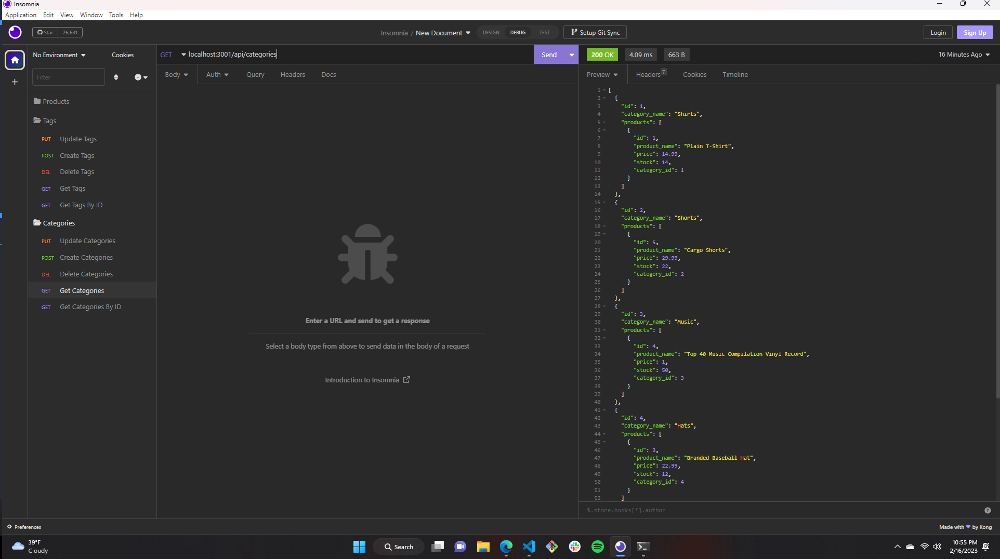

# ecommerce backend
https://github.com/coltonsmith135/ecommerce backend

# Description
This project is about seeding data into a database and being able to get that data and either update data, create data, or delete data.
# Table of Contents:
* [Installation](#installation)
* [Usage](#usage)

 * [License](#License)

* [Credits](#credits)
* [Tests](#tests)

## installation

express.js, dotenv, mysql2, sequelize, node.js

## contact info

coltonsmith135@yahoo.com

5034320228

## usage

it is used using insomnia to run all of your routes

## License

  MIT

## credits

colton smith

## tests

through insomnia

https://drive.google.com/file/d/1QtdskgLgYsVstxnQO8PjJgFEkaLTYUOv/view

https://github.com/coltonsmith135/e-commerce-back-end

